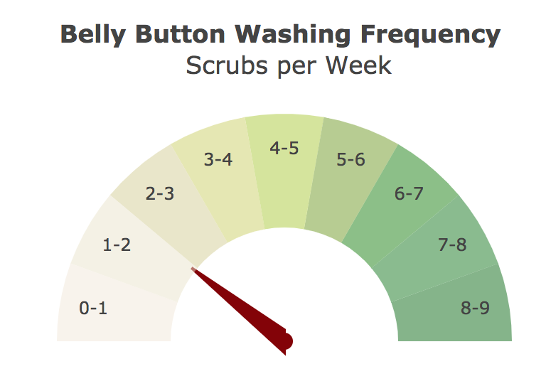

# Belly_Button_Challenge

Background
In this assignment, you will build an interactive dashboard to explore the Belly Button Biodiversity datasetLinks to an external site., which catalogs the microbes that colonize human navels.
The dataset reveals that a small handful of microbial species (also called operational taxonomic units, or OTUs, in the study) were present in more than 70% of people, while the rest were relatively rare.

Before You Begin
Create a new repository for this project called belly-button-challenge. Do not add this Challenge to an existing repository.
Clone the new repository to your computer.
Inside your local git repository, copy the files from in the StarterCode folder contained within the Module 14 Challenge zip file. i.e. index.html, samples.json, and the static folder.

NOTE
You will not be required to access the samples.json file locally, but it is provided for reference.
Push the above changes to GitHub.
Deploy the new repository to GitHub Pages.

Complete the following steps:
1 - Use the D3 library to read in samples.json from the URL https://2u-data-curriculum-team.s3.amazonaws.com/dataviz-classroom/v1.1/14-Interactive-Web-Visualizations/02-Homework/samples.json.
2 - Create a horizontal bar chart with a dropdown menu to display the top 10 OTUs found in that individual.

3 - Create a bubble chart that displays each sample.

4 - Display the sample metadata, i.e., an individual's demographic information.

5 - Display each key-value pair from the metadata JSON object somewhere on the page.
6 - Update all the plots when a new sample is selected. Additionally, you are welcome to create any layout that you would like for your dashboard. 
Bonus 
Adapt the Gauge Chart from https://plot.ly/javascript/gauge-charts/Links to an external site. to plot the weekly washing frequency of the individual.
